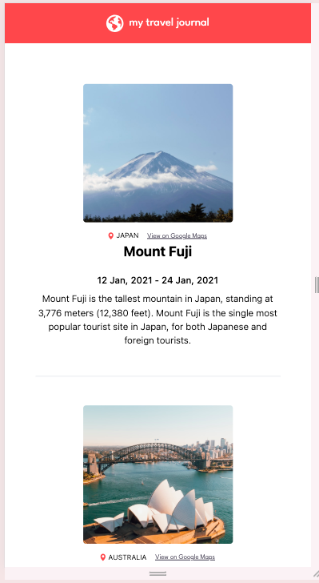
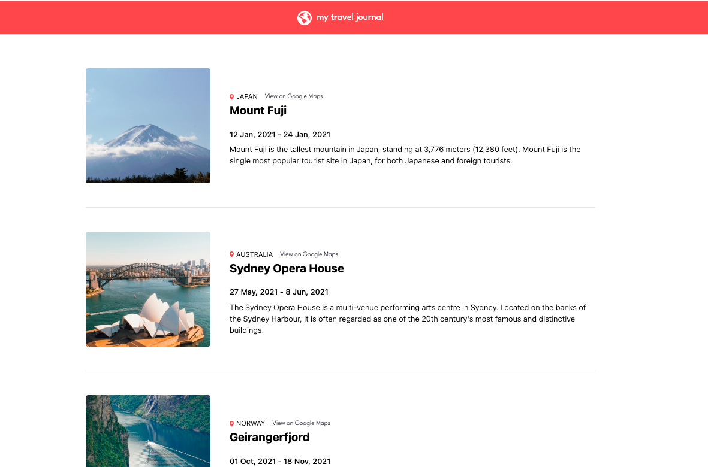

# 🌍 Travel-Journal
<small>A Scrimba-Task</small>

A clean, simple travel log. This project focuses on **reusability**, **responsive design**, and **creating components from an array of data**.

[View website](https://travel-journal-qdo6.vercel.app/) | [I learnt something check it out](https://www.linkedin.com/pulse/why-your-flexbox-layout-breaks-large-screens-how-fix-adeyeye-i4d0e)

***

🚀 The Project
This Travel Journal is a frontend challenge designed to practice mapping over data and implementing precise UI designs. The goal was to create a sleek, mobile-responsive layout that maintains its editorial feel across all devices.

## Key Features
* Dynamic Rendering: Content is managed via a centralized data file and rendered dynamically through React components.

* Responsive Layout: Uses Flexbox and media queries to transition from a stacked mobile view to a side-by-side desktop view.

* Sleek UI: Custom letter-spacing (tracking-widest), specific color palettes for brand consistency, and clean border logic.

* Accessible Links: Integrated "View on Google Maps" links for every destination.


## Tech Stack
* Frontend: React.js

* Styling: Tailwind CSS

* Icons: SVG 

* Deployment: Vercel (or your preferred platform)


## Preview
| Desktop Version | Mobile Version |
| :---: | :---:|
|  | 


##  Getting Started

1. **Clone the repo**
   ```bash
   git clone [https://github.com/your-username/travel-journal.git](https://github.com/your-username/travel-journal.git)
2. **Install dependencies
 ```bash
 npm install